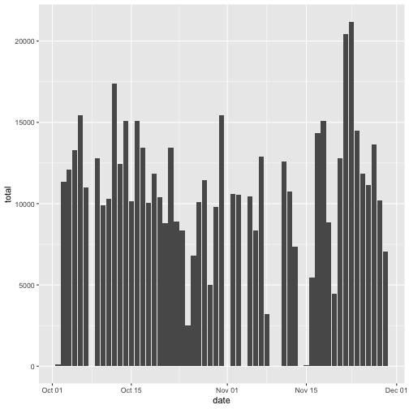
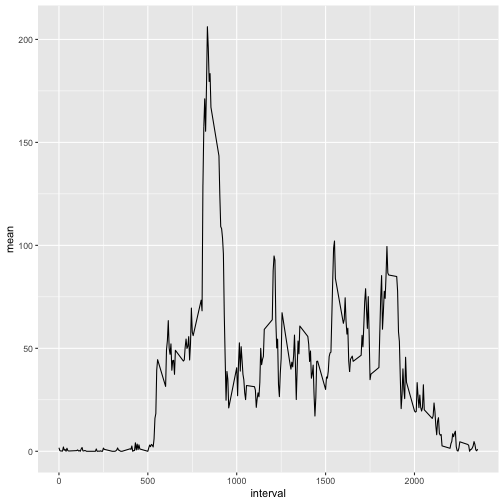
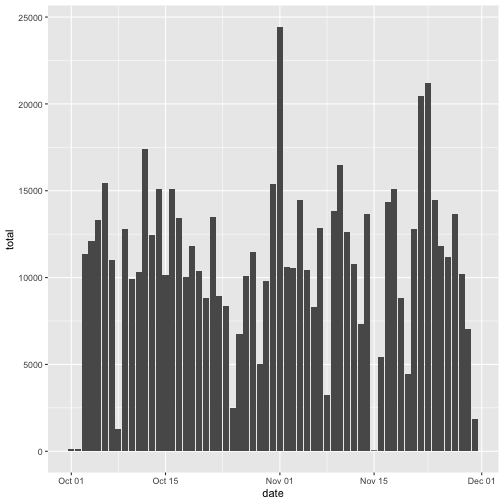
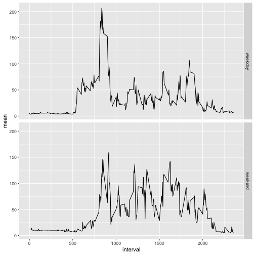

## Loading and preprocessing the data
load data from local csv file

```r
d1 <- read.csv('activity.csv', sep=',', header = TRUE)
str(d1)
```

```
## 'data.frame':	17568 obs. of  3 variables:
##  $ steps   : int  NA NA NA NA NA NA NA NA NA NA ...
##  $ date    : chr  "2012-10-01" "2012-10-01" "2012-10-01" "2012-10-01" ...
##  $ interval: int  0 5 10 15 20 25 30 35 40 45 ...
```
the data loaded has 3 variables including:
- **steps**: Number of steps taking in a 5-minute interval
- **date**: The date on which the measurement was taken in YYYY-MM-DD format
- **interval**: Identifier for the 5-minute interval in which measurement was taken

it has 17568 observations but some values missing，and the variable data need to be transform to Date type.

```r
d1$date <- as.Date(d1$date)
```

## What is mean total number of steps taken per day?


```r
library(dplyr)
sp <- group_by(d1, date)
sp <- as.data.frame(summarize(sp, mean=mean(steps),median = median(steps), total=sum(steps)))
sp
```

```
##          date       mean median total
## 1  2012-10-01         NA     NA    NA
## 2  2012-10-02  0.4375000      0   126
## 3  2012-10-03 39.4166667      0 11352
## 4  2012-10-04 42.0694444      0 12116
## 5  2012-10-05 46.1597222      0 13294
## 6  2012-10-06 53.5416667      0 15420
## 7  2012-10-07 38.2465278      0 11015
## 8  2012-10-08         NA     NA    NA
## 9  2012-10-09 44.4826389      0 12811
## 10 2012-10-10 34.3750000      0  9900
## 11 2012-10-11 35.7777778      0 10304
## 12 2012-10-12 60.3541667      0 17382
## 13 2012-10-13 43.1458333      0 12426
## 14 2012-10-14 52.4236111      0 15098
## 15 2012-10-15 35.2048611      0 10139
## 16 2012-10-16 52.3750000      0 15084
## 17 2012-10-17 46.7083333      0 13452
## 18 2012-10-18 34.9166667      0 10056
## 19 2012-10-19 41.0729167      0 11829
## 20 2012-10-20 36.0937500      0 10395
## 21 2012-10-21 30.6284722      0  8821
## 22 2012-10-22 46.7361111      0 13460
## 23 2012-10-23 30.9652778      0  8918
## 24 2012-10-24 29.0104167      0  8355
## 25 2012-10-25  8.6527778      0  2492
## 26 2012-10-26 23.5347222      0  6778
## 27 2012-10-27 35.1354167      0 10119
## 28 2012-10-28 39.7847222      0 11458
## 29 2012-10-29 17.4236111      0  5018
## 30 2012-10-30 34.0937500      0  9819
## 31 2012-10-31 53.5208333      0 15414
## 32 2012-11-01         NA     NA    NA
## 33 2012-11-02 36.8055556      0 10600
## 34 2012-11-03 36.7048611      0 10571
## 35 2012-11-04         NA     NA    NA
## 36 2012-11-05 36.2465278      0 10439
## 37 2012-11-06 28.9375000      0  8334
## 38 2012-11-07 44.7326389      0 12883
## 39 2012-11-08 11.1770833      0  3219
## 40 2012-11-09         NA     NA    NA
## 41 2012-11-10         NA     NA    NA
## 42 2012-11-11 43.7777778      0 12608
## 43 2012-11-12 37.3784722      0 10765
## 44 2012-11-13 25.4722222      0  7336
## 45 2012-11-14         NA     NA    NA
## 46 2012-11-15  0.1423611      0    41
## 47 2012-11-16 18.8923611      0  5441
## 48 2012-11-17 49.7881944      0 14339
## 49 2012-11-18 52.4652778      0 15110
## 50 2012-11-19 30.6979167      0  8841
## 51 2012-11-20 15.5277778      0  4472
## 52 2012-11-21 44.3993056      0 12787
## 53 2012-11-22 70.9270833      0 20427
## 54 2012-11-23 73.5902778      0 21194
## 55 2012-11-24 50.2708333      0 14478
## 56 2012-11-25 41.0902778      0 11834
## 57 2012-11-26 38.7569444      0 11162
## 58 2012-11-27 47.3819444      0 13646
## 59 2012-11-28 35.3576389      0 10183
## 60 2012-11-29 24.4687500      0  7047
## 61 2012-11-30         NA     NA    NA
```
we've got **total,mean and median** of steps per day all in  data frame nameed **sp**,it has 61 rows

let's maek a histogram of the total number of steps taken each day by ggplot2

```r
library(ggplot2)
g <- ggplot(sp,aes(date,total))
g + geom_histogram(stat = 'identity') 
```

```
## Warning: Ignoring unknown parameters: binwidth, bins, pad
```

```
## Warning: Removed 8 rows containing missing values (position_stack).
```



## What is the average daily activity pattern?
calculate average steps of the 5-minute interval across all days then sort data by mean variable

```r
si <- group_by(d1, interval)
si <- as.data.frame(summarize(si, mean=mean(steps, na.rm=TRUE),))
si[order(si$mean, decreasing = TRUE),]
```

```
##     interval        mean
## 104      835 206.1698113
## 105      840 195.9245283
## 107      850 183.3962264
## 106      845 179.5660377
## 103      830 177.3018868
## 101      820 171.1509434
## 108      855 167.0188679
## 100      815 157.5283019
## 102      825 155.3962264
## 109      900 143.4528302
## 99       810 129.4339623
## 110      905 124.0377358
## 111      910 109.1132075
## 112      915 108.1132075
## 113      920 103.7169811
## 191     1550 102.1132075
## 226     1845  99.4528302
## 190     1545  98.6603774
## 114      925  95.9622642
## 147     1210  94.8490566
## 148     1215  92.7735849
## 146     1205  87.6981132
## 227     1850  86.5849057
## 228     1855  85.6037736
## 225     1840  85.3396226
## 220     1815  85.3207547
## 229     1900  84.8679245
## 192     1555  83.9622642
## 189     1540  82.9056604
## 210     1725  78.9433962
## 230     1905  77.8301887
## 223     1830  77.6981132
## 213     1740  75.0943396
## 219     1810  74.6981132
## 195     1610  74.5471698
## 224     1835  74.2452830
## 97       800  73.3773585
## 209     1720  72.7169811
## 94       745  69.5471698
## 211     1730  68.9433962
## 98       805  68.2075472
## 222     1825  67.7735849
## 156     1255  67.2830189
## 115      930  66.2075472
## 188     1535  65.3207547
## 194     1605  64.1320755
## 145     1200  63.8679245
## 76       615  63.4528302
## 149     1220  63.3962264
## 196     1615  63.1698113
## 193     1600  62.1320755
## 208     1715  61.2264151
## 168     1355  60.8113208
## 198     1625  59.7735849
## 212     1735  59.6603774
## 221     1820  59.2641509
## 144     1155  59.1886792
## 231     1910  58.0377358
## 218     1805  58.0188679
## 95       750  57.8490566
## 197     1620  56.9056604
## 214     1745  56.5094340
## 162     1325  56.4339623
## 206     1705  56.3018868
## 96       755  56.1509434
## 169     1400  55.7547170
## 91       730  55.6792453
## 88       715  54.5094340
## 151     1230  54.4716981
## 75       610  53.7735849
## 166     1345  53.5471698
## 232     1915  53.3584906
## 124     1015  52.6603774
## 93       740  52.2641509
## 79       630  52.1509434
## 170     1405  51.9622642
## 90       725  50.9811321
## 126     1025  50.7924528
## 207     1710  50.7169811
## 87       710  50.5094340
## 150     1225  50.1698113
## 140     1135  49.9811321
## 77       620  49.9622642
## 89       720  49.9245283
## 74       605  49.2641509
## 84       655  49.0377358
## 172     1415  48.6981132
## 187     1530  48.1320755
## 186     1525  47.7547170
## 167     1350  47.3207547
## 78       625  47.0754717
## 205     1700  46.6226415
## 161     1320  46.2452830
## 203     1650  46.2075472
## 143     1150  46.0377358
## 185     1520  45.9622642
## 239     1950  45.6603774
## 202     1645  45.4528302
## 116      935  45.2264151
## 155     1250  45.0566038
## 201     1640  44.6603774
## 142     1145  44.6037736
## 72       555  44.4905660
## 86       705  44.3773585
## 92       735  44.3207547
## 127     1030  44.2830189
## 82       645  44.1698113
## 81       640  44.0188679
## 199     1630  43.8679245
## 85       700  43.8113208
## 180     1455  43.7735849
## 204     1655  43.6792453
## 179     1450  43.6226415
## 171     1410  43.5849057
## 159     1310  43.2641509
## 163     1330  42.7547170
## 123     1010  42.4150943
## 157     1300  42.3396226
## 141     1140  42.0377358
## 175     1430  41.8490566
## 160     1315  40.9811321
## 217     1800  40.6792453
## 121     1000  40.5660377
## 236     1935  40.0188679
## 165     1340  39.9622642
## 158     1305  39.8867925
## 71       550  39.4528302
## 80       635  39.3396226
## 125     1020  38.9245283
## 184     1515  38.8490566
## 118      945  38.7547170
## 200     1635  38.5660377
## 154     1245  37.7358491
## 174     1425  37.5471698
## 216     1755  37.4528302
## 128     1035  37.4150943
## 83       650  37.3584906
## 233     1920  36.3207547
## 182     1505  36.0754717
## 183     1510  35.4905660
## 173     1420  35.4716981
## 119      950  34.9811321
## 215     1750  34.7735849
## 129     1040  34.6981132
## 240     1955  33.5283019
## 139     1130  33.4339623
## 244     2015  33.3396226
## 152     1235  32.4150943
## 251     2050  32.3018868
## 132     1055  31.9433962
## 73       600  31.4905660
## 133     1100  31.3584906
## 237     1940  30.2075472
## 181     1500  30.0188679
## 134     1105  29.6792453
## 137     1120  28.3773585
## 130     1045  28.3396226
## 176     1435  27.5094340
## 235     1930  27.3962264
## 247     2030  27.3018868
## 122     1005  26.9811321
## 245     2020  26.8113208
## 153     1240  26.5283019
## 138     1125  26.4716981
## 178     1445  26.0754717
## 136     1115  25.5471698
## 238     1945  25.5471698
## 164     1335  25.1320755
## 131     1050  25.0943396
## 117      940  24.7924528
## 255     2110  23.4528302
## 248     2035  21.3396226
## 135     1110  21.3207547
## 250     2045  21.3207547
## 246     2025  21.1698113
## 120      955  21.0566038
## 234     1925  20.7169811
## 252     2055  20.1509434
## 241     2000  19.6226415
## 249     2040  19.5471698
## 243     2010  19.3396226
## 256     2115  19.2452830
## 242     2005  19.0188679
## 70       545  18.3396226
## 254     2105  17.2264151
## 177     1440  17.1132075
## 260     2135  16.3018868
## 69       540  16.0188679
## 253     2100  15.9433962
## 259     2130  14.6603774
## 257     2120  12.4528302
## 271     2230   9.7547170
## 270     2225   8.6981132
## 261     2140   8.6792453
## 268     2215   8.5094340
## 263     2150   8.1320755
## 258     2125   8.0188679
## 262     2145   7.7924528
## 269     2220   7.0754717
## 68       535   6.0566038
## 267     2210   4.8113208
## 284     2335   4.6981132
## 276     2255   4.6037736
## 55       430   4.1132075
## 266     2205   3.6792453
## 57       440   3.4905660
## 65       520   3.3207547
## 277     2300   3.3018868
## 285     2340   3.3018868
## 59       450   3.1132075
## 63       510   3.0000000
## 66       525   2.9622642
## 278     2305   2.8490566
## 264     2155   2.6226415
## 283     2330   2.6037736
## 51       410   2.5660377
## 64       515   2.2452830
## 272     2235   2.2075472
## 6         25   2.0943396
## 67       530   2.0943396
## 19       130   1.8301887
## 1          0   1.7169811
## 43       330   1.6226415
## 275     2250   1.6037736
## 282     2325   1.5849057
## 62       505   1.5660377
## 35       250   1.5471698
## 10        45   1.4716981
## 265     2200   1.4528302
## 49       400   1.1886792
## 27       210   1.1320755
## 18       125   1.1132075
## 60       455   1.1132075
## 288     2355   1.0754717
## 281     2320   0.9622642
## 36       255   0.9433962
## 50       405   0.9433962
## 8         35   0.8679245
## 58       445   0.8301887
## 280     2315   0.8301887
## 14       105   0.6792453
## 56       435   0.6603774
## 286     2345   0.6415094
## 42       325   0.6226415
## 44       335   0.5849057
## 7         30   0.5283019
## 45       340   0.4905660
## 22       145   0.3773585
## 54       425   0.3584906
## 2          5   0.3396226
## 16       115   0.3396226
## 53       420   0.3396226
## 13       100   0.3207547
## 273     2240   0.3207547
## 11        50   0.3018868
## 23       150   0.2641509
## 32       235   0.2264151
## 287     2350   0.2264151
## 41       320   0.2075472
## 20       135   0.1698113
## 21       140   0.1698113
## 4         15   0.1509434
## 15       110   0.1509434
## 3         10   0.1320755
## 12        55   0.1320755
## 30       225   0.1320755
## 274     2245   0.1132075
## 5         20   0.0754717
## 46       345   0.0754717
## 9         40   0.0000000
## 17       120   0.0000000
## 24       155   0.0000000
## 25       200   0.0000000
## 26       205   0.0000000
## 28       215   0.0000000
## 29       220   0.0000000
## 31       230   0.0000000
## 33       240   0.0000000
## 34       245   0.0000000
## 37       300   0.0000000
## 38       305   0.0000000
## 39       310   0.0000000
## 40       315   0.0000000
## 47       350   0.0000000
## 48       355   0.0000000
## 52       415   0.0000000
## 61       500   0.0000000
## 279     2310   0.0000000
```
the  **835**th interval has the maximum number of steps, let's draw plot

```r
g2 <- ggplot(si,aes(interval,mean))
g2 + geom_line() 
```




## Imputing missing values
check which variable has missing values

```r
sapply(d1,anyNA)
```

```
##    steps     date interval 
##     TRUE    FALSE    FALSE
```
only steps has NAs

find the number of rows which has missing values

```r
Nat <- sum(is.na(d1))
Nat
```

```
## [1] 2304
```
the dataset has **2304** rows with missing value

use the mean for that 5-minute interval to fill these NAs

```r
m <- merge(d1[is.na(d1),],si,by = 'interval')
d2 <- d1[,]
d2[is.na(d2),'steps'] <- m$mean
head(d2[is.na(d1),],10)
```

```
##        steps       date interval
## 1  1.7169811 2012-10-01        0
## 2  1.7169811 2012-10-01        5
## 3  1.7169811 2012-10-01       10
## 4  1.7169811 2012-10-01       15
## 5  1.7169811 2012-10-01       20
## 6  1.7169811 2012-10-01       25
## 7  1.7169811 2012-10-01       30
## 8  1.7169811 2012-10-01       35
## 9  0.3396226 2012-10-01       40
## 10 0.3396226 2012-10-01       45
```
now we've filled all missing values and saved to the new dataset **d2** then compare with the first part's results

use **d2** calculate the mean, total and median as we do before

```r
sp2 <- group_by(d2, date)
sp2 <- as.data.frame(summarize(sp2, mean=mean(steps),median = median(steps), total=sum(steps)))
cp_sp <- merge(sp, sp2, by = 'date')
##cp_sp <- cp_sp %>%  mutate(mean_comp = mean.y-mean.x, total_comp =  total.y-total.x, median_comp = median.y-median.x) %>% select(date, total_comp, median_comp, mean_comp)
cp_sp
```

```
##          date     mean.x median.x total.x     mean.y   median.y    total.y
## 1  2012-10-01         NA       NA      NA  0.4779874  0.1981132   137.6604
## 2  2012-10-02  0.4375000        0     126  0.4375000  0.0000000   126.0000
## 3  2012-10-03 39.4166667        0   11352 39.4166667  0.0000000 11352.0000
## 4  2012-10-04 42.0694444        0   12116 42.0694444  0.0000000 12116.0000
## 5  2012-10-05 46.1597222        0   13294 46.1597222  0.0000000 13294.0000
## 6  2012-10-06 53.5416667        0   15420 53.5416667  0.0000000 15420.0000
## 7  2012-10-07 38.2465278        0   11015 38.2465278  0.0000000 11015.0000
## 8  2012-10-08         NA       NA      NA  4.4963312  1.0283019  1294.9434
## 9  2012-10-09 44.4826389        0   12811 44.4826389  0.0000000 12811.0000
## 10 2012-10-10 34.3750000        0    9900 34.3750000  0.0000000  9900.0000
## 11 2012-10-11 35.7777778        0   10304 35.7777778  0.0000000 10304.0000
## 12 2012-10-12 60.3541667        0   17382 60.3541667  0.0000000 17382.0000
## 13 2012-10-13 43.1458333        0   12426 43.1458333  0.0000000 12426.0000
## 14 2012-10-14 52.4236111        0   15098 52.4236111  0.0000000 15098.0000
## 15 2012-10-15 35.2048611        0   10139 35.2048611  0.0000000 10139.0000
## 16 2012-10-16 52.3750000        0   15084 52.3750000  0.0000000 15084.0000
## 17 2012-10-17 46.7083333        0   13452 46.7083333  0.0000000 13452.0000
## 18 2012-10-18 34.9166667        0   10056 34.9166667  0.0000000 10056.0000
## 19 2012-10-19 41.0729167        0   11829 41.0729167  0.0000000 11829.0000
## 20 2012-10-20 36.0937500        0   10395 36.0937500  0.0000000 10395.0000
## 21 2012-10-21 30.6284722        0    8821 30.6284722  0.0000000  8821.0000
## 22 2012-10-22 46.7361111        0   13460 46.7361111  0.0000000 13460.0000
## 23 2012-10-23 30.9652778        0    8918 30.9652778  0.0000000  8918.0000
## 24 2012-10-24 29.0104167        0    8355 29.0104167  0.0000000  8355.0000
## 25 2012-10-25  8.6527778        0    2492  8.6527778  0.0000000  2492.0000
## 26 2012-10-26 23.5347222        0    6778 23.5347222  0.0000000  6778.0000
## 27 2012-10-27 35.1354167        0   10119 35.1354167  0.0000000 10119.0000
## 28 2012-10-28 39.7847222        0   11458 39.7847222  0.0000000 11458.0000
## 29 2012-10-29 17.4236111        0    5018 17.4236111  0.0000000  5018.0000
## 30 2012-10-30 34.0937500        0    9819 34.0937500  0.0000000  9819.0000
## 31 2012-10-31 53.5208333        0   15414 53.5208333  0.0000000 15414.0000
## 32 2012-11-01         NA       NA      NA 84.8747379 54.1415094 24443.9245
## 33 2012-11-02 36.8055556        0   10600 36.8055556  0.0000000 10600.0000
## 34 2012-11-03 36.7048611        0   10571 36.7048611  0.0000000 10571.0000
## 35 2012-11-04         NA       NA      NA 50.2101677 39.7452830 14460.5283
## 36 2012-11-05 36.2465278        0   10439 36.2465278  0.0000000 10439.0000
## 37 2012-11-06 28.9375000        0    8334 28.9375000  0.0000000  8334.0000
## 38 2012-11-07 44.7326389        0   12883 44.7326389  0.0000000 12883.0000
## 39 2012-11-08 11.1770833        0    3219 11.1770833  0.0000000  3219.0000
## 40 2012-11-09         NA       NA      NA 47.9968553 43.6981132 13823.0943
## 41 2012-11-10         NA       NA      NA 57.1472746 56.4056604 16458.4151
## 42 2012-11-11 43.7777778        0   12608 43.7777778  0.0000000 12608.0000
## 43 2012-11-12 37.3784722        0   10765 37.3784722  0.0000000 10765.0000
## 44 2012-11-13 25.4722222        0    7336 25.4722222  0.0000000  7336.0000
## 45 2012-11-14         NA       NA      NA 47.4842767 38.1698113 13675.4717
## 46 2012-11-15  0.1423611        0      41  0.1423611  0.0000000    41.0000
## 47 2012-11-16 18.8923611        0    5441 18.8923611  0.0000000  5441.0000
## 48 2012-11-17 49.7881944        0   14339 49.7881944  0.0000000 14339.0000
## 49 2012-11-18 52.4652778        0   15110 52.4652778  0.0000000 15110.0000
## 50 2012-11-19 30.6979167        0    8841 30.6979167  0.0000000  8841.0000
## 51 2012-11-20 15.5277778        0    4472 15.5277778  0.0000000  4472.0000
## 52 2012-11-21 44.3993056        0   12787 44.3993056  0.0000000 12787.0000
## 53 2012-11-22 70.9270833        0   20427 70.9270833  0.0000000 20427.0000
## 54 2012-11-23 73.5902778        0   21194 73.5902778  0.0000000 21194.0000
## 55 2012-11-24 50.2708333        0   14478 50.2708333  0.0000000 14478.0000
## 56 2012-11-25 41.0902778        0   11834 41.0902778  0.0000000 11834.0000
## 57 2012-11-26 38.7569444        0   11162 38.7569444  0.0000000 11162.0000
## 58 2012-11-27 47.3819444        0   13646 47.3819444  0.0000000 13646.0000
## 59 2012-11-28 35.3576389        0   10183 35.3576389  0.0000000 10183.0000
## 60 2012-11-29 24.4687500        0    7047 24.4687500  0.0000000  7047.0000
## 61 2012-11-30         NA       NA      NA  6.3731656  4.1415094  1835.4717
```
the median , mean and total are the **same** as the results of the first part 

plot the total number of steps taken each day

```r
g <- ggplot(sp2,aes(date,total))
g + geom_histogram(stat = 'identity') 
```

```
## Warning: Ignoring unknown parameters: binwidth, bins, pad
```



## Are there differences in activity patterns between weekdays and weekends?
make a new dataset **dw** which has week_cat variable that divide the data into "weekday" or "weekend"

```r
dw <- d2 %>% mutate(week_cat = factor(weekdays(date),
                                levels = c('Monday','Tuesday','Wednesday','Thursday','Friday','Saturday','Sunday'),
                                labels = c('weekday','weekday','weekday','weekday','weekday','weekend','weekend')))
dw[dw$week_cat=='weekday',]
```

```
##         steps       date interval week_cat
## 1   1.7169811 2012-10-01        0  weekday
## 2   1.7169811 2012-10-01        5  weekday
## 3   1.7169811 2012-10-01       10  weekday
## 4   1.7169811 2012-10-01       15  weekday
## 5   1.7169811 2012-10-01       20  weekday
## 6   1.7169811 2012-10-01       25  weekday
## 7   1.7169811 2012-10-01       30  weekday
## 8   1.7169811 2012-10-01       35  weekday
## 9   0.3396226 2012-10-01       40  weekday
## 10  0.3396226 2012-10-01       45  weekday
## 11  0.3396226 2012-10-01       50  weekday
## 12  0.3396226 2012-10-01       55  weekday
## 13  0.3396226 2012-10-01      100  weekday
## 14  0.3396226 2012-10-01      105  weekday
## 15  0.3396226 2012-10-01      110  weekday
## 16  0.3396226 2012-10-01      115  weekday
## 17  0.1320755 2012-10-01      120  weekday
## 18  0.1320755 2012-10-01      125  weekday
## 19  0.1320755 2012-10-01      130  weekday
## 20  0.1320755 2012-10-01      135  weekday
## 21  0.1320755 2012-10-01      140  weekday
## 22  0.1320755 2012-10-01      145  weekday
## 23  0.1320755 2012-10-01      150  weekday
## 24  0.1320755 2012-10-01      155  weekday
## 25  0.1509434 2012-10-01      200  weekday
## 26  0.1509434 2012-10-01      205  weekday
## 27  0.1509434 2012-10-01      210  weekday
## 28  0.1509434 2012-10-01      215  weekday
## 29  0.1509434 2012-10-01      220  weekday
## 30  0.1509434 2012-10-01      225  weekday
## 31  0.1509434 2012-10-01      230  weekday
## 32  0.1509434 2012-10-01      235  weekday
## 33  0.0754717 2012-10-01      240  weekday
## 34  0.0754717 2012-10-01      245  weekday
## 35  0.0754717 2012-10-01      250  weekday
## 36  0.0754717 2012-10-01      255  weekday
## 37  0.0754717 2012-10-01      300  weekday
## 38  0.0754717 2012-10-01      305  weekday
## 39  0.0754717 2012-10-01      310  weekday
## 40  0.0754717 2012-10-01      315  weekday
## 41  2.0943396 2012-10-01      320  weekday
## 42  2.0943396 2012-10-01      325  weekday
## 43  2.0943396 2012-10-01      330  weekday
## 44  2.0943396 2012-10-01      335  weekday
## 45  2.0943396 2012-10-01      340  weekday
## 46  2.0943396 2012-10-01      345  weekday
## 47  2.0943396 2012-10-01      350  weekday
## 48  2.0943396 2012-10-01      355  weekday
## 49  0.5283019 2012-10-01      400  weekday
## 50  0.5283019 2012-10-01      405  weekday
## 51  0.5283019 2012-10-01      410  weekday
## 52  0.5283019 2012-10-01      415  weekday
## 53  0.5283019 2012-10-01      420  weekday
## 54  0.5283019 2012-10-01      425  weekday
## 55  0.5283019 2012-10-01      430  weekday
## 56  0.5283019 2012-10-01      435  weekday
## 57  0.8679245 2012-10-01      440  weekday
## 58  0.8679245 2012-10-01      445  weekday
## 59  0.8679245 2012-10-01      450  weekday
## 60  0.8679245 2012-10-01      455  weekday
## 61  0.8679245 2012-10-01      500  weekday
## 62  0.8679245 2012-10-01      505  weekday
## 63  0.8679245 2012-10-01      510  weekday
## 64  0.8679245 2012-10-01      515  weekday
## 65  0.0000000 2012-10-01      520  weekday
## 66  0.0000000 2012-10-01      525  weekday
## 67  0.0000000 2012-10-01      530  weekday
## 68  0.0000000 2012-10-01      535  weekday
## 69  0.0000000 2012-10-01      540  weekday
## 70  0.0000000 2012-10-01      545  weekday
## 71  0.0000000 2012-10-01      550  weekday
## 72  0.0000000 2012-10-01      555  weekday
## 73  1.4716981 2012-10-01      600  weekday
## 74  1.4716981 2012-10-01      605  weekday
## 75  1.4716981 2012-10-01      610  weekday
## 76  1.4716981 2012-10-01      615  weekday
## 77  1.4716981 2012-10-01      620  weekday
## 78  1.4716981 2012-10-01      625  weekday
## 79  1.4716981 2012-10-01      630  weekday
## 80  1.4716981 2012-10-01      635  weekday
## 81  0.3018868 2012-10-01      640  weekday
## 82  0.3018868 2012-10-01      645  weekday
## 83  0.3018868 2012-10-01      650  weekday
## 84  0.3018868 2012-10-01      655  weekday
## 85  0.3018868 2012-10-01      700  weekday
## 86  0.3018868 2012-10-01      705  weekday
## 87  0.3018868 2012-10-01      710  weekday
## 88  0.3018868 2012-10-01      715  weekday
## 89  0.1320755 2012-10-01      720  weekday
## 90  0.1320755 2012-10-01      725  weekday
## 91  0.1320755 2012-10-01      730  weekday
## 92  0.1320755 2012-10-01      735  weekday
## 93  0.1320755 2012-10-01      740  weekday
## 94  0.1320755 2012-10-01      745  weekday
## 95  0.1320755 2012-10-01      750  weekday
## 96  0.1320755 2012-10-01      755  weekday
## 97  0.3207547 2012-10-01      800  weekday
## 98  0.3207547 2012-10-01      805  weekday
## 99  0.3207547 2012-10-01      810  weekday
## 100 0.3207547 2012-10-01      815  weekday
## 101 0.3207547 2012-10-01      820  weekday
## 102 0.3207547 2012-10-01      825  weekday
## 103 0.3207547 2012-10-01      830  weekday
## 104 0.3207547 2012-10-01      835  weekday
## 105 0.6792453 2012-10-01      840  weekday
## 106 0.6792453 2012-10-01      845  weekday
## 107 0.6792453 2012-10-01      850  weekday
## 108 0.6792453 2012-10-01      855  weekday
## 109 0.6792453 2012-10-01      900  weekday
## 110 0.6792453 2012-10-01      905  weekday
## 111 0.6792453 2012-10-01      910  weekday
## 112 0.6792453 2012-10-01      915  weekday
## 113 0.1509434 2012-10-01      920  weekday
## 114 0.1509434 2012-10-01      925  weekday
## 115 0.1509434 2012-10-01      930  weekday
## 116 0.1509434 2012-10-01      935  weekday
## 117 0.1509434 2012-10-01      940  weekday
## 118 0.1509434 2012-10-01      945  weekday
## 119 0.1509434 2012-10-01      950  weekday
## 120 0.1509434 2012-10-01      955  weekday
## 121 0.3396226 2012-10-01     1000  weekday
## 122 0.3396226 2012-10-01     1005  weekday
## 123 0.3396226 2012-10-01     1010  weekday
## 124 0.3396226 2012-10-01     1015  weekday
## 125 0.3396226 2012-10-01     1020  weekday
## 126 0.3396226 2012-10-01     1025  weekday
## 127 0.3396226 2012-10-01     1030  weekday
## 128 0.3396226 2012-10-01     1035  weekday
## 129 0.0000000 2012-10-01     1040  weekday
## 130 0.0000000 2012-10-01     1045  weekday
## 131 0.0000000 2012-10-01     1050  weekday
## 132 0.0000000 2012-10-01     1055  weekday
## 133 0.0000000 2012-10-01     1100  weekday
## 134 0.0000000 2012-10-01     1105  weekday
## 135 0.0000000 2012-10-01     1110  weekday
## 136 0.0000000 2012-10-01     1115  weekday
## 137 1.1132075 2012-10-01     1120  weekday
## 138 1.1132075 2012-10-01     1125  weekday
## 139 1.1132075 2012-10-01     1130  weekday
## 140 1.1132075 2012-10-01     1135  weekday
## 141 1.1132075 2012-10-01     1140  weekday
## 142 1.1132075 2012-10-01     1145  weekday
## 143 1.1132075 2012-10-01     1150  weekday
## 144 1.1132075 2012-10-01     1155  weekday
## 145 1.8301887 2012-10-01     1200  weekday
## 146 1.8301887 2012-10-01     1205  weekday
## 147 1.8301887 2012-10-01     1210  weekday
## 148 1.8301887 2012-10-01     1215  weekday
## 149 1.8301887 2012-10-01     1220  weekday
## 150 1.8301887 2012-10-01     1225  weekday
## 151 1.8301887 2012-10-01     1230  weekday
## 152 1.8301887 2012-10-01     1235  weekday
## 153 0.1698113 2012-10-01     1240  weekday
## 154 0.1698113 2012-10-01     1245  weekday
## 155 0.1698113 2012-10-01     1250  weekday
## 156 0.1698113 2012-10-01     1255  weekday
## 157 0.1698113 2012-10-01     1300  weekday
## 158 0.1698113 2012-10-01     1305  weekday
## 159 0.1698113 2012-10-01     1310  weekday
## 160 0.1698113 2012-10-01     1315  weekday
## 161 0.1698113 2012-10-01     1320  weekday
## 162 0.1698113 2012-10-01     1325  weekday
## 163 0.1698113 2012-10-01     1330  weekday
## 164 0.1698113 2012-10-01     1335  weekday
## 165 0.1698113 2012-10-01     1340  weekday
## 166 0.1698113 2012-10-01     1345  weekday
## 167 0.1698113 2012-10-01     1350  weekday
## 168 0.1698113 2012-10-01     1355  weekday
## 169 0.3773585 2012-10-01     1400  weekday
## 170 0.3773585 2012-10-01     1405  weekday
## 171 0.3773585 2012-10-01     1410  weekday
## 172 0.3773585 2012-10-01     1415  weekday
## 173 0.3773585 2012-10-01     1420  weekday
## 174 0.3773585 2012-10-01     1425  weekday
## 175 0.3773585 2012-10-01     1430  weekday
## 176 0.3773585 2012-10-01     1435  weekday
## 177 0.2641509 2012-10-01     1440  weekday
## 178 0.2641509 2012-10-01     1445  weekday
## 179 0.2641509 2012-10-01     1450  weekday
## 180 0.2641509 2012-10-01     1455  weekday
## 181 0.2641509 2012-10-01     1500  weekday
## 182 0.2641509 2012-10-01     1505  weekday
## 183 0.2641509 2012-10-01     1510  weekday
## 184 0.2641509 2012-10-01     1515  weekday
## 185 0.0000000 2012-10-01     1520  weekday
## 186 0.0000000 2012-10-01     1525  weekday
## 187 0.0000000 2012-10-01     1530  weekday
## 188 0.0000000 2012-10-01     1535  weekday
## 189 0.0000000 2012-10-01     1540  weekday
## 190 0.0000000 2012-10-01     1545  weekday
## 191 0.0000000 2012-10-01     1550  weekday
## 192 0.0000000 2012-10-01     1555  weekday
## 193 0.0000000 2012-10-01     1600  weekday
## 194 0.0000000 2012-10-01     1605  weekday
## 195 0.0000000 2012-10-01     1610  weekday
## 196 0.0000000 2012-10-01     1615  weekday
## 197 0.0000000 2012-10-01     1620  weekday
## 198 0.0000000 2012-10-01     1625  weekday
## 199 0.0000000 2012-10-01     1630  weekday
## 200 0.0000000 2012-10-01     1635  weekday
## 201 0.0000000 2012-10-01     1640  weekday
## 202 0.0000000 2012-10-01     1645  weekday
## 203 0.0000000 2012-10-01     1650  weekday
## 204 0.0000000 2012-10-01     1655  weekday
## 205 0.0000000 2012-10-01     1700  weekday
## 206 0.0000000 2012-10-01     1705  weekday
## 207 0.0000000 2012-10-01     1710  weekday
## 208 0.0000000 2012-10-01     1715  weekday
## 209 1.1320755 2012-10-01     1720  weekday
## 210 1.1320755 2012-10-01     1725  weekday
## 211 1.1320755 2012-10-01     1730  weekday
## 212 1.1320755 2012-10-01     1735  weekday
## 213 1.1320755 2012-10-01     1740  weekday
## 214 1.1320755 2012-10-01     1745  weekday
## 215 1.1320755 2012-10-01     1750  weekday
## 216 1.1320755 2012-10-01     1755  weekday
## 217 0.0000000 2012-10-01     1800  weekday
## 218 0.0000000 2012-10-01     1805  weekday
## 219 0.0000000 2012-10-01     1810  weekday
## 220 0.0000000 2012-10-01     1815  weekday
## 221 0.0000000 2012-10-01     1820  weekday
## 222 0.0000000 2012-10-01     1825  weekday
## 223 0.0000000 2012-10-01     1830  weekday
## 224 0.0000000 2012-10-01     1835  weekday
## 225 0.0000000 2012-10-01     1840  weekday
## 226 0.0000000 2012-10-01     1845  weekday
## 227 0.0000000 2012-10-01     1850  weekday
## 228 0.0000000 2012-10-01     1855  weekday
## 229 0.0000000 2012-10-01     1900  weekday
## 230 0.0000000 2012-10-01     1905  weekday
## 231 0.0000000 2012-10-01     1910  weekday
## 232 0.0000000 2012-10-01     1915  weekday
## 233 0.1320755 2012-10-01     1920  weekday
## 234 0.1320755 2012-10-01     1925  weekday
## 235 0.1320755 2012-10-01     1930  weekday
## 236 0.1320755 2012-10-01     1935  weekday
## 237 0.1320755 2012-10-01     1940  weekday
## 238 0.1320755 2012-10-01     1945  weekday
## 239 0.1320755 2012-10-01     1950  weekday
## 240 0.1320755 2012-10-01     1955  weekday
## 241 0.0000000 2012-10-01     2000  weekday
## 242 0.0000000 2012-10-01     2005  weekday
## 243 0.0000000 2012-10-01     2010  weekday
## 244 0.0000000 2012-10-01     2015  weekday
## 245 0.0000000 2012-10-01     2020  weekday
## 246 0.0000000 2012-10-01     2025  weekday
## 247 0.0000000 2012-10-01     2030  weekday
## 248 0.0000000 2012-10-01     2035  weekday
## 249 0.2264151 2012-10-01     2040  weekday
## 250 0.2264151 2012-10-01     2045  weekday
##  [ reached 'max' / getOption("max.print") -- omitted 12710 rows ]
```
Make a panel plot containing a time series plot  of the 5-minute interval (x-axis) and the average number of steps taken, averaged across all weekday days or weekend days

```r
si2 <- group_by(dw, interval, week_cat)
si2 <- as.data.frame(summarize(si2, mean=mean(steps, na.rm=TRUE)))
```

```
## `summarise()` has grouped output by 'interval'. You can override using the `.groups` argument.
```

```r
g3 <- ggplot(si2,aes(interval,mean))
g3 + geom_line() + facet_grid(week_cat~.)
```



